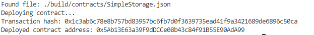

# 1. Screenshot of the console output immediately after you have successfully deployed a smart contract

# 2. Transaction hash from the contract deployment 
0x1c3ab6c78e8b757bd83957bc6fb7d0f3639735ead41f9a3421689de6896c50ca

# 3. Deployed contract address from the contract deployment 

0x5Ab13E63a39F9dDCCe08b43c84f91B55E90AdA99
