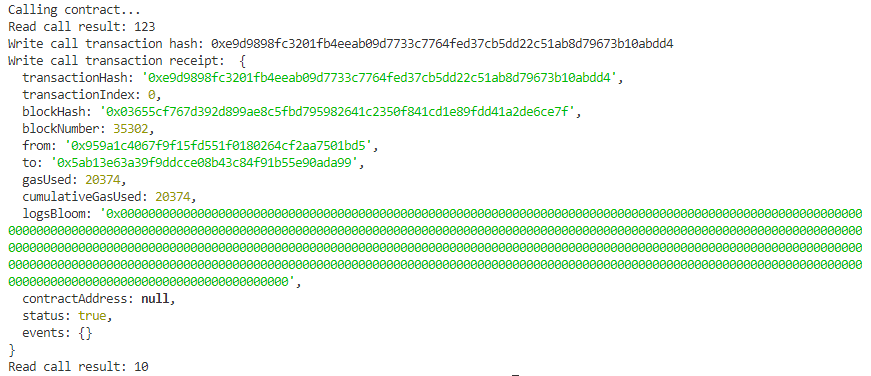

## 1.Smart contract call.



## 2. The transaction hash 

   <b>0xe9d9898fc3201fb4eeab09d7733c7764fed37cb5dd22c51ab8d79673b10abdd4</b> <br><br>   

## 3. The contract address that you called .

    0x5Ab13E63a39F9dDCCe08b43c84f91B55E90AdA99

## 4. The ABI for contract you made a call on .

```
[
  {
    "inputs": [],
    "stateMutability": "payable",
    "type": "constructor"
  },
  {
    "inputs": [
      {
        "internalType": "uint256",
        "name": "x",
        "type": "uint256"
      }
    ],
    "name": "set",
    "outputs": [],
    "stateMutability": "payable",
    "type": "function"
  },
  {
    "inputs": [],
    "name": "get",
    "outputs": [
      {
        "internalType": "uint256",
        "name": "",
        "type": "uint256"
      }
    ],
    "stateMutability": "view",
    "type": "function"
  }
]
```
